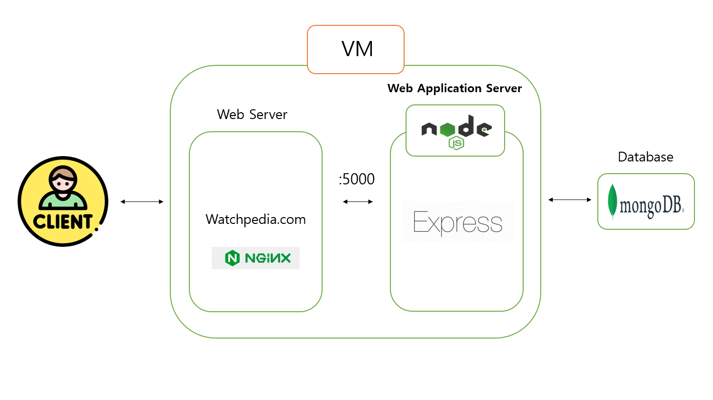

 <h1>WatchPedia</h1> 

  
 

# WatchPedia

- 스마트워치 구매 웹사이트

- 사용자의 빠른 주문 및 배송이 가능하도록 단순화된 UI와 최소한의 기능 제공

## 서비스 구성 안내

## 1. 서비스 소개

- 기술 스택

  - FrontEnd : HTML, CSS, JavaScript, Bulma
  - BackEnd : Express, MongoDB, Mongoose, Nodejs

  # API 명세서

  # [https://www.notion.so/bf509b36161445f1909b0d08695b4648?v=bd202ffd964849899f15d3518e0fdbfc&pvs=4](https://www.notion.so/bf509b36161445f1909b0d08695b4648?v=bd202ffd964849899f15d3518e0fdbfc&pvs=4).

## 2. 서비스 주요 기능 설명

**웹서비스의 유용성, 편의성 및 시각화의 실용성에 대한 설명**

- 주요 기능 (주된 활용성) 및 서브 기능 소개
- 프로젝트만의 차별점, 기대 효과

## 3. 서비스 구성도

## 4. 프로젝트 팀원 역할 분담

| 이름   | 담당 업무 |
| ------ | --------- |
| 최현수 | 팀장/BE   |
| 고연지 | BE        |
| 김현정 | FE        |
| 서유정 | FE        |
| 이채연 | FE        |
| 한지혜 | FE        |

**멤버별 responsibility**

1. 최현수: 팀장/백엔드 담당

- product, category 스키마 설계 및 API 구현

2. 고연지: 백엔드/프론트엔드 담당

- 로그인/회원가입, order 스키마 설계 및 API 구현, 환경세팅

3. 김현정: 프론트엔드 담당

- 회원가입, 로그인, 장바구니(주문 생성 및 결제)

4. 서유정: 프론트엔드 담당

- 홈, 제품 목록, 제품 상세

5. 이채연: 프론트엔드 담당

- 관리자 페이지, 주문관리, 회원관리, 카테고리 및 상품관리

6. 한지혜: 프론트엔드 담당

- 마이페이지 (회원정보 수정, 주문/배송 조회, 회원탈퇴)

## 5. 폴더 구조

    - 프론트: src/views
    - 백: src/view 이외 전체 폴더
    - 실행: 프론트, 백 동시에 express로 실행

## 5. 실행 방법

- npm install
